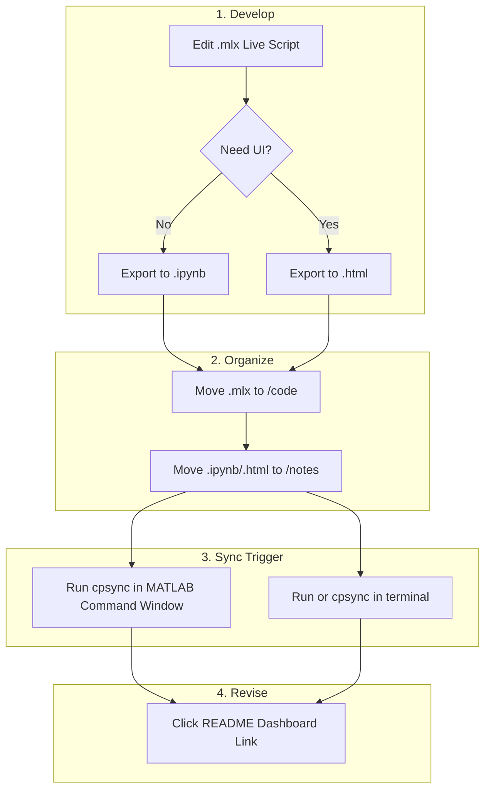

# 🔬 Computational Physics Study Portal
**Author:** Aditya Krishna Panickar  
**Goal:** A centralized repository for MATLAB simulations, theory, and exam revision for computational physics

---

## 📂 Project Structure
Managed via `.gitignore` to exclude MATLAB internal metadata (`_rels`, `metadata`).

```text
Computational-Physics/
├── Topics/
│   └── {Serial Number}_{Topic name}/
│       ├── code/       # Master: .mlx (Live Scripts)
│       └── notes/      # .ipynb (GitHub Viewer) & .html (Interactive)
├── Data/               # Input datasets (.csv, .mat)
├── Utils/              # Helper functions
└── README.md           # This Dashboard
```
## 📊 Topic Dashboard


| Topic | Title | Study Notes (Rendered) | Master Code |
| :--- | :--- | :--- | :--- |
| **04** | Spectral Schemes | [🚀 View Notebook](./Topics/04_SpectralScheme_PDEs/notes/FFT_InvFFT.ipynb) | [💻 .mlx](./Topics/04_SpectralScheme_PDEs/code/FFT_InvFFT.mlx) |

## WorkFlow Graph

(Note: cpsync is the alais for the bash script created to sync the web repo and the device folder. Do not forget your PAT for GitHub)

## The bash script: Automating the pull, add, commit and push. 

```#!/bin/bash
echo "--- Starting Physics Sync ---"
git pull origin main                      # H: Syncs Web Edits
git add .                                 # Stages folder changes
git commit -m "Physics Update: $(date)"   # Signs off locally
git push origin main                      # I: Uploads to GitHub
echo "--- ✅ Dashboard Updated! ---"
```
One needs to create this file(.sh, created using nano) inside the directory where the files that one uploads live. 

Then, one needs to give permission to the file by running ```chmod +x sync.sh ``` inside the terminal. Finally, we create an alias for it, called cpsync.  


