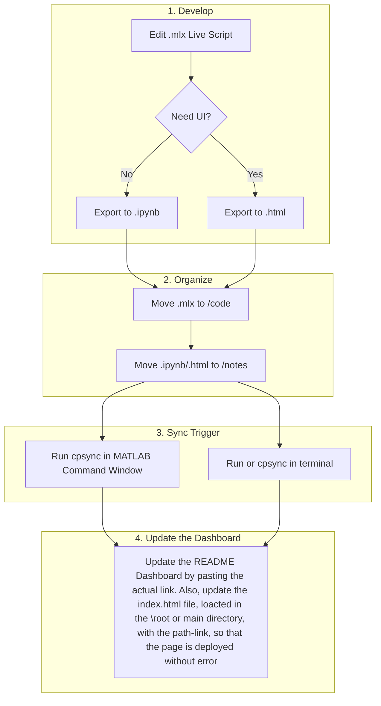

# 🔬 Computational Physics Study Portal
**Author:** Aditya Krishna Panickar  
**Goal:** A centralized repository for MATLAB simulations, theory, and exam revision for computational physics

---

## 📂 Project Structure
Managed via `.gitignore` to exclude MATLAB internal metadata (`_rels`, `metadata`).

```text
Computational-Physics/
├── Topics/
│   └── {Serial Number}_{Topic name}/
│       ├── code/       # Master: .mlx (Live Scripts)
│       └── notes/      # .ipynb (GitHub Viewer) & .html (Interactive)
├── Data/               # Input datasets (.csv, .mat)
├── Utils/              # Helper functions
└── README.md           # This Dashboard
```
# Computational Physics 🚀

[Click here to view the Live Notes Dashboard](https://dasaditya936.github.io/Computational-Physics/)

Welcome to my repository...


## 📊 Code Script Dashboard


| Topic | Title | CodeScripts | Model Code from Sir |
| :--- | :--- | :--- | :--- |
| **04** | **Spectral Schemes** | :--- | :--- |
| **04.1** | Plotting FFT | [Matlab CodeScript for FFT](./Topics/04_SpectralScheme_PDEs/code/MyCode/plotingFFT.m) | :--- |
| **04.2** | 1D Diffusion | [Matlab CodeScript for Spectral Method for Diffusion](./Topics/04_SpectralScheme_PDEs/code/MyCode/spect_diff.m) |[From Soling](./Topics/04_SpectralScheme_PDEs/code/Modelcode_Soling/soling_spectdiff.m) |
| **04.3** | 1D Fokker-Planck  | [Matlab CodeScript for Spectral Method for Fokker-Planck](./Topics/04_SpectralScheme_PDEs/code/MyCode/fokkerPlanck1D.m) |[From Soling](./Topics/04_SpectralScheme_PDEs/code/Modelcode_Soling/soling_1DFokkerPlanck.m) |


## WorkFlow Graph

(Note: cpsync is the alais for the bash script created to sync the web repo and the device folder. Do not forget your PAT for GitHub)
WARNING::: If you want to keep them on GitHub but remove them from your laptop, DON'T run your ```cpsync``` script after deleting them locally. You want your GitHub to contain most stuff and delete things from the machine, if things do get cluttered. If you delete the files and then run ```git add.``` and ```git commit-m```. before pulling, Git will think you wanted to delete them from GitHub too. When you push, your GitHub repo will become empty!     

## The bash script: Automating the pull, add, commit and push. 

```#!/bin/bash
# 1. SAVE LOCAL WORK FIRST
git add .
git commit -m "Physics Update: $(date)" || echo "No new changes to save"

# 2. BRING IN WEB UPDATES (Now it's safe!)
git pull origin main --rebase

# 3. UPLOAD EVERYTHING
git push origin main

```
One needs to create this file(.sh, created using nano) inside the directory where the files that one uploads live. 

Then, one needs to give permission to the file by running ```chmod +x sync.sh ``` inside the terminal. Finally, we create an alias for it, called cpsync.  Also, for 
the matlab cpsync() command to work, we need to create a ```startup.m``` file (and type ```run startup.m``` in the command window). The ```startup.m``` file contains:
```
% startup.m - Aditya's Physics Portal Configuration

% JOB 1: Add the main directory to MATLAB's search path 
% Ensures cpsync() works even when you are deep in Topics/04/code/
addpath('/home/adityadas/codingProjects/MATLAB_CodeScripts');

% JOB 2: Define the cpsync function handle with the System Library Fix
% 'LD_LIBRARY_PATH=' clears MATLAB's old internal libraries 
% so it can use Debian's modern Git/SSH/SSL without "symbol lookup" errors.
cpsync = @() system('LD_LIBRARY_PATH= /home/adityadas/codingProjects/MATLAB_CodeScripts/sync.sh');

% JOB 3: Status confirmation on startup
fprintf('🚀 Physics Portal Active: Type cpsync() to sync with GitHub\n');

```


